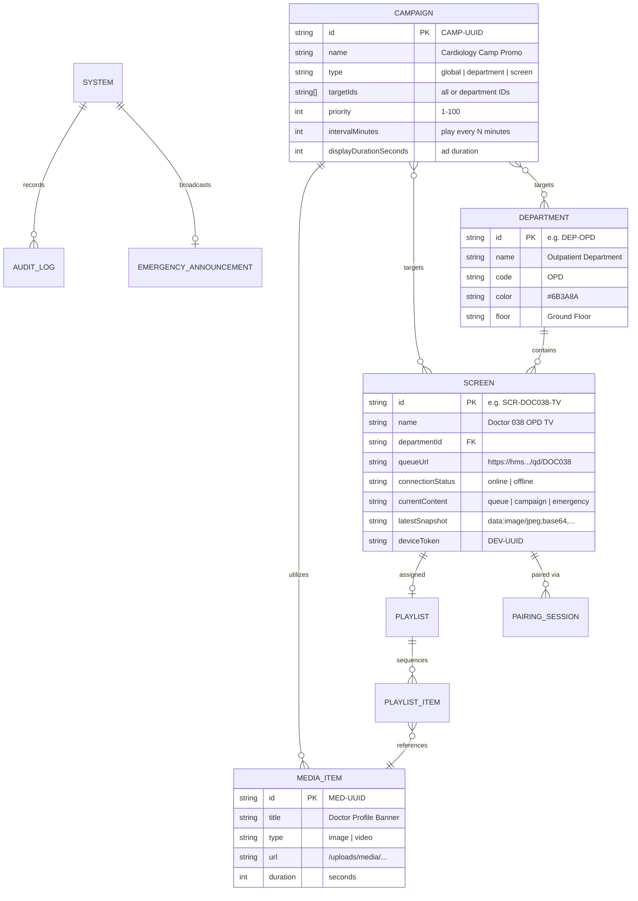
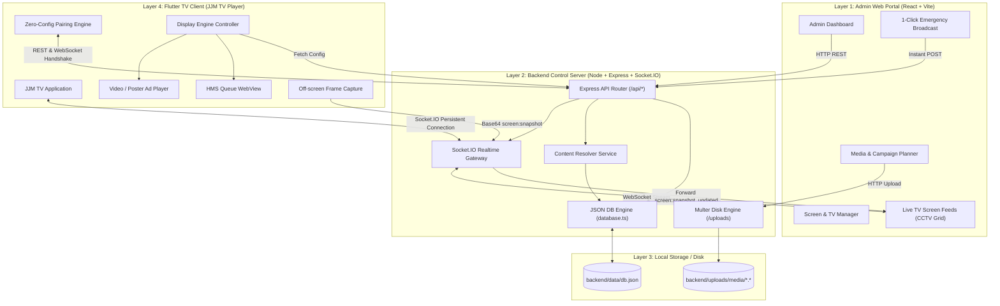
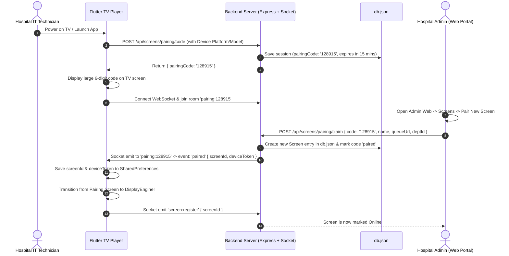
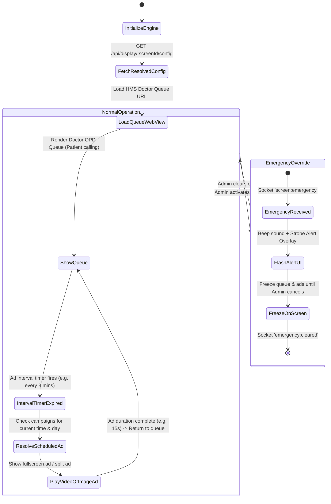

# JJM Hospital - Digital Signage & Queue Display System
## Complete System Architecture, Database Design & Technical Flow Documentation

---

## 📌 1. Executive Summary & System Purpose

The **JJM Hospital Digital Signage & Queue Display System** is an enterprise-grade, synchronized multi-screen solution engineered specifically for **JJM Hospital Kashipur**.

### Core Objectives:
1. **Doctor OPD Queue Integration**: Real-time rendering of live doctor patient queues from the Hospital Management System (HMS Web: `https://hms.jjmhospitalkashipur.com/qd/<DOC_CODE>`).
2. **Scheduled Advertising & Public Awareness**: Seamlessly overlaying or alternating between live patient queues and hospital marketing videos, posters, health awareness announcements, and seasonal camps.
3. **Emergency Code Broadcast**: Instantaneous, hospital-wide audio-visual alerts (e.g., Code Blue, Fire Alert, Disaster response) that override all screens in < 500 milliseconds.
4. **Zero-Touch Remote Management**: Hardware pairing via 6-digit codes, over-the-air schedule updates, and live CCTV-like screen snapshot streaming back to the admin portal.

---

## 🛠️ 2. Technology Stack Breakdown

| Layer | Component | Technology / Library | Purpose & Responsibilities |
| :--- | :--- | :--- | :--- |
| **Backend** | Server Runtime | **Node.js + TypeScript** | High-performance asynchronous execution engine |
| **Backend** | Web Framework | **Express.js (v4.21)** | RESTful API endpoints for CRUD, pairing, and media uploads |
| **Backend** | Real-time Engine | **Socket.IO (v4.8)** | Bi-directional WebSocket communication for instant TV sync |
| **Backend** | File Uploads | **Multer (v1.4.5)** | Handling multipart video/image storage with disk naming |
| **Backend** | Database | **Custom JSON Engine (`fs`)** | Zero-dependency, lightweight file storage (`backend/data/db.json`) |
| **Frontend** | Admin Web Portal | **React 18 + TypeScript** | SPA control panel for hospital administrators |
| **Frontend** | Bundler & Dev Tool | **Vite (v6.1)** | Fast HMR and optimized production bundling |
| **Frontend** | HTTP Client | **Axios (v1.7)** | REST API queries with dynamic backend switching (Live vs Local) |
| **Frontend** | Icons & Styling | **Lucide-React + Vanilla CSS** | Custom responsive dark/light glassmorphic hospital UI |
| **TV Player** | Display Engine | **Flutter 3.x (Dart 3.9+)** | Native 60 FPS TV renderer for Android TV & Fire TV |
| **TV Player** | Web Engine | **webview_flutter (v4.10)** | Hardware-accelerated browser rendering for HMS doctor queues |
| **TV Player** | Media Playback | **video_player + cached_network_image** | High-definition MP4/WEBM video looping and poster caching |
| **TV Player** | TV Power & Kiosk | **wakelock_plus + Kotlin BootReceiver** | Keeps TV backlight active 24/7 and auto-starts on boot/power-cycle |

---

## 💾 3. Database Architecture & Storage Details

### 3.1 Where and How Data is Stored
Instead of an external heavyweight database daemon, the backend operates on a **file-based JSON document store**:
* **Database File**: `backend/data/db.json`
* **Data Access Module**: `backend/src/db/database.ts`
* **Media Assets Directory**: `backend/uploads/media/`

```
backend/
├── data/
│   └── db.json               <--- Primary Database (JSON documents)
└── uploads/
    └── media/                <--- Storage for video files & image posters
        ├── cardiology_camp_1710928392.jpg
        └── health_checkup_1710928491.mp4
```

### 3.2 Data Management Lifecycle
1. **On Server Startup**:
   - The `Database` singleton reads `backend/data/db.json` using `fs.readFileSync()`.
   - The JSON string is parsed into an in-memory TypeScript interface `DatabaseSchema`.
2. **On Write / Mutation (CRUD)**:
   - Any create, update, or delete operation modifies the in-memory JavaScript objects.
   - Immediately invokes `this.saveData()`, which calls `fs.writeFileSync(DB_FILE, JSON.stringify(this.data, null, 2))`.
   - Writes are atomic and formatted with 2-space indentation for human inspectability.
3. **Media Upload Storage**:
   - File binaries are intercepted by `multer.diskStorage`.
   - Files are saved to `backend/uploads/media/` with sanitized timestamped filenames.
   - Only the public web path (e.g. `/uploads/media/filename.mp4`) and metadata (duration, file size, MIME type) are written into `db.json`.

### 3.3 Database Schema Entity Relationships



---

## 🔄 4. System Architecture & Complete Data Flow



---

## 🛰️ 5. Step-by-Step Technical Lifecycles

### Flow A: Zero-Config Screen Pairing Lifecycle



---

### Flow B: Content Resolution & Display Execution Loop

How the TV determines what to display at any second:



---

### Flow C: Live CCTV Snapshot Stream (Remote Screen Monitoring)

To allow the administrative team to verify what is physically showing on all hospital TVs without walking to the rooms:

```mermaid
sequenceDiagram
    autonumber
    participant TV as Flutter TV Player
    participant Key as RenderRepaintBoundary
    participant BE as Backend Socket.IO Server
    participant Admin as Admin Web Live Feeds

    loop Every 8 to 15 seconds
        TV->>Key: Capture current frame as ByteData (ui.Image)
        Key-->>TV: Convert to compressed PNG / JPEG bytes
        TV->>BE: Socket emit 'screen:snapshot' { screenId, image: 'data:image/jpeg;base64,...' }
        BE->>BE: Store latestSnapshot in memory / db.json
        BE->>Admin: Socket emit 'screen:snapshot_updated' { screenId, image }
        Admin->>Admin: Update CCTV thumbnail in real-time grid
    end
```

---

## 📡 6. Complete API & WebSocket Event Reference

### 6.1 Core REST Endpoints

| Method | Endpoint | Description | Key Body Parameters |
| :--- | :--- | :--- | :--- |
| `GET` | `/api/health` | Server uptime & status check | None |
| `POST` | `/api/screens/pairing/code` | TV requests a 6-digit code | `{ deviceMetadata }` |
| `POST` | `/api/screens/pairing/claim` | Admin pairs code with screen | `{ pairingCode, name, queueUrl, departmentId }` |
| `GET` | `/api/display/:screenId/config` | TV retrieves resolved configuration | None |
| `POST` | `/api/display/:screenId/heartbeat` | TV sends fallback HTTP heartbeat | `{ currentContent, playerVersion }` |
| `POST` | `/api/media` | Upload promotional video/image | Multipart form data (`file`, `title`, `duration`) |
| `POST` | `/api/campaigns` | Create scheduled campaign | `{ name, mediaUrl, priority, intervalMinutes, targetIds }` |
| `POST` | `/api/emergency` | Trigger hospital emergency alert | `{ title, message, severity, targetType, targetIds }` |
| `DELETE`| `/api/emergency` | Clear active emergency alert | None |

### 6.2 Real-time Socket.IO Events

| Event Name | Direction | Payload | Description |
| :--- | :--- | :--- | :--- |
| `screen:register` | TV ➔ Server | `{ screenId, deviceToken }` | TV announces presence & joins screen room |
| `screen:heartbeat` | TV ➔ Server | `{ screenId, currentContent }` | Periodic health ping (keeps status 'online') |
| `screen:snapshot` | TV ➔ Server | `{ screenId, image }` | Transmits live canvas snapshot (Base64 JPEG) |
| `screen:status_change` | Server ➔ Admin | `{ screenId, status: 'online'\|'offline' }` | Notifies web dashboard of TV connection state |
| `screen:config_update` | Server ➔ TV | `{ screenId, config }` | Instructs TV to immediately apply new schedule/URL |
| `screen:emergency` | Server ➔ TV | `{ alert: EmergencyAnnouncement }` | High-priority emergency broadcast override |
| `emergency:cleared` | Server ➔ TV | `{}` | Reverts screens back to normal queue & ads |

---

## 📁 7. Codebase Directory Structure & Key Files

```
JJM_advertising/
├── Admin_Website/                       # React 18 Admin Dashboard
│   ├── src/
│   │   ├── components/                 # Modals, Navbar, Screen Cards, CCTV Grid
│   │   ├── pages/
│   │   │   ├── Dashboard.tsx           # High-level overview & quick actions
│   │   │   ├── Screens.tsx             # Screen pairing, queue URL configuration
│   │   │   ├── LiveFeeds.tsx           # Multi-screen CCTV monitoring view
│   │   │   ├── Campaigns.tsx           # Ad scheduling & priority rules
│   │   │   ├── MediaLibrary.tsx        # Video & poster upload center
│   │   │   └── EmergencyAnnouncements.tsx # Hospital-wide Code Red/Blue triggers
│   │   ├── services/
│   │   │   ├── api.ts                  # Axios configuration with live/local toggle
│   │   │   └── socket.ts               # Socket.IO connection manager
│   │   └── App.tsx                     # Routing & master layout
│   └── package.json
│
├── backend/                            # Express + Socket.IO Server
│   ├── data/
│   │   └── db.json                     # Primary JSON database
│   ├── uploads/
│   │   └── media/                      # Physical storage for posters & videos
│   ├── src/
│   │   ├── db/
│   │   │   └── database.ts             # JSON file reader/writer & CRUD operations
│   │   ├── routes/
│   │   │   ├── screens.routes.ts       # Pairing & screen management
│   │   │   ├── display.routes.ts       # Config resolution & heartbeat endpoints
│   │   │   ├── media.routes.ts         # Multer file upload handlers
│   │   │   ├── campaigns.routes.ts     # Campaign scheduling APIs
│   │   │   └── emergency.routes.ts     # Emergency alert broadcast routes
│   │   ├── services/
│   │   │   └── resolverService.ts      # Computes active content for any screen
│   │   ├── types/
│   │   │   └── index.ts                # TypeScript data models & interfaces
│   │   └── server.ts                   # Express & Socket.IO server initialization
│   └── package.json
│
└── JJM_TV_player/                       # Flutter Android TV Application
    ├── android/app/src/main/kotlin/
    │   └── com/jjm/tv/BootReceiver.kt  # Auto-start app on Android TV boot
    ├── lib/
    │   ├── core/
    │   │   ├── network/api_service.dart   # REST API client
    │   │   ├── websocket/socket_service.dart # Realtime socket listener
    │   │   └── storage/storage_service.dart # SharedPreferences persistent cache
    │   ├── models/
    │   │   └── display_models.dart      # Resolved config data structures
    │   ├── screens/
    │   │   ├── pairing/pairing_view.dart# 6-Digit pairing code screen
    │   │   └── display/
    │   │       └── display_engine.dart  # Master player: WebView + Video + Snapshot
    │   └── main.dart                   # Flutter app entry point & boot router
    └── pubspec.yaml
```

---

## 🔒 8. Fail-Safe & High Availability Architecture

1. **Network Interruption Resilience**:
   - If Wi-Fi or Internet disconnects, the Flutter TV player retains the last known resolved configuration in `SharedPreferences`.
   - The HMS WebView will display the cached queue or reconnect automatically via built-in retry logic.
   - Any locally downloaded or cached campaign assets will continue to play on schedule.
2. **Auto-Power & Kiosk Mode**:
   - `wakelock_plus` prevents the Android TV OS from entering standby or turning off the screen.
   - `BootReceiver.kt` listens for `android.intent.action.BOOT_COMPLETED` so the display app launches immediately whenever power is restored after a power cut.
3. **Ghost Screen Detection**:
   - The backend runs an automated health monitor every 15 seconds.
   - If a screen fails to emit a heartbeat for more than 60 seconds, it is marked as `offline`, and the admin dashboard updates visually with no manual refresh needed.
